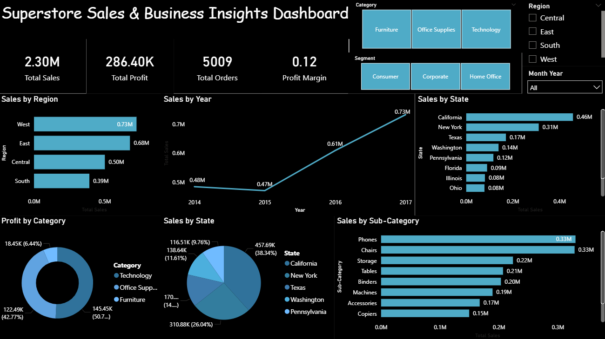

# 📊 Superstore Sales & Business Insights Dashboard

## 📌 Project Overview

This project was developed as part of a **Data Analytics Internship**.  
The objective was to create a fully interactive dashboard using Power BI to analyze retail sales performance and generate actionable business insights.

The dashboard provides a dynamic view of sales, profit, orders, and profitability trends across regions, states, and product categories.

---

## 🎯 Project Objectives

- Analyze overall revenue and profit performance
- Identify top-performing regions and states
- Evaluate product category and sub-category performance
- Track yearly sales growth trends
- Enable interactive filtering for dynamic business analysis

---

## 🛠 Tools & Technologies Used

- Power BI
- DAX (Data Analysis Expressions)
- Data Cleaning & Transformation
- Top N Filtering
- Interactive Slicers
- Data Visualization Techniques

---

## 📂 Dataset Used

Sample Superstore Dataset

The dataset includes:
- Order Date
- Region
- State
- Category
- Sub-Category
- Sales
- Profit
- Quantity
- Discount

---

## 📊 Dashboard Features

- KPI Cards (Total Sales, Total Profit, Total Orders, Profit Margin)
- Sales by Region Analysis
- Yearly Sales Trend
- Top 10 States by Sales
- Top 10 Sub-Categories by Sales
- Top 5 States Pie Analysis
- Interactive slicers (Category, Segment, Region, Month-Year)
- Cross-filtering between visuals

---

## 🔎 Key Business Insights

- The West region generates the highest sales revenue.
- Technology category contributes the highest profit.
- Sales show consistent growth from 2015 to 2017.
- Revenue is concentrated among the top-performing states.
- Certain sub-categories significantly drive total sales performance.

---

## 📈 Dashboard Preview

(Add your dashboard screenshot in the repository and name it: dashboard.png)

Then ensure this line works automatically:

---

## 💼 Internship Submission

This project demonstrates:

- Data Visualization Skills
- Business Analytics & Interpretation
- Dashboard Design Best Practices
- Analytical Thinking
- Interactive Reporting

---

## 👩‍💼 Author

Pavithra L  
MBA – Finance & Business Analytics  
Data Analytics Intern
pavithral.analytics@gmail.com
